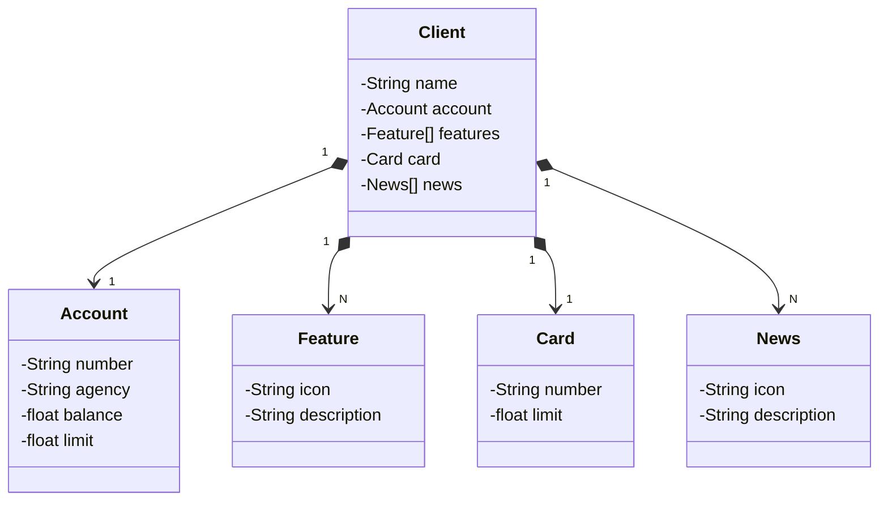

#Santander Bootcamp 2024

##Diagrama de Classes

```mermaid
classDiagram
    class Client {
        -String name
        -Account account
        -Feature[] features
        -Card card
        -News[] news
    }

    class Account {
        -String number
        -String agency
        -float balance
        -float limit
    }

    class Feature {
        -String icon
        -String description
    }

    class Card {
        -String number
        -float limit
    }

    class News {
        -String icon
        -String description
    }

    Client "1" *--> "1" Account
    Client "1" *--> "N" Feature
    Client "1" *--> "1" Card
    Client "1" *--> "N" News
```

